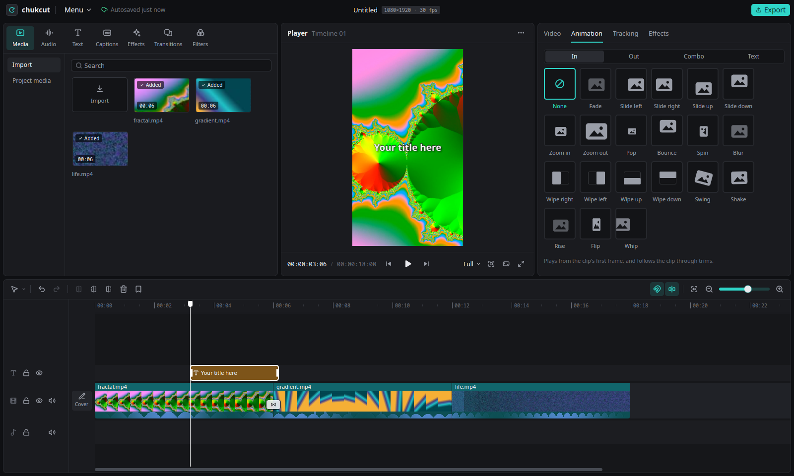
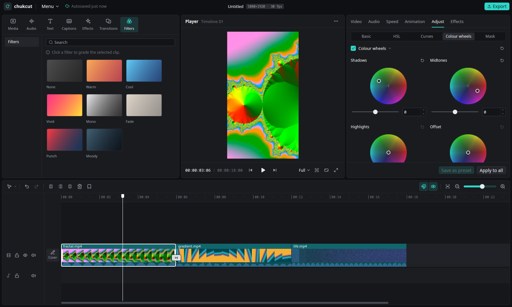
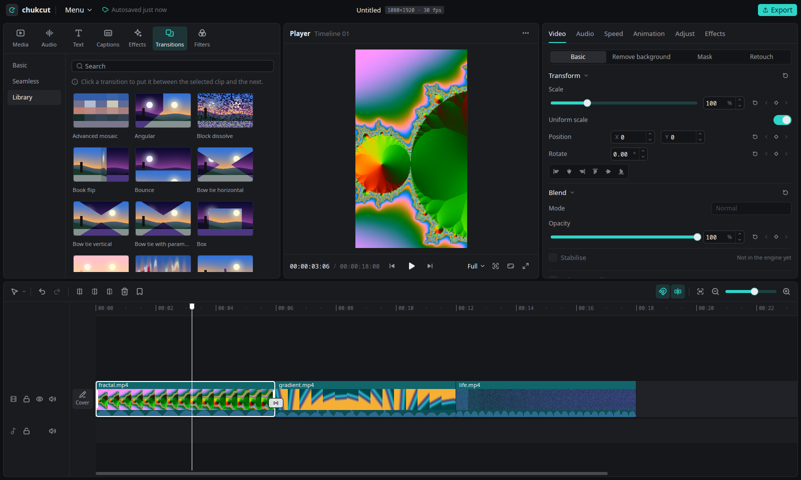

# chukcut

**A CapCut-style video editor for Linux, with a native GPU interface.**
Open a phone video, cut it, grade it, caption it and export it. The interface
and the compositor both run on the GPU, in one Rust process. The AI tools run
on your machine, not in a cloud.

[](https://github.com/chuk-development/chukcut/actions/workflows/ci.yml)
[](LICENSE)
[](https://www.rust-lang.org)



> **Status: early.** The features below exist and have tests. The app is not
> yet a daily driver. Some panels have rough edges. The section
> [What is rough](#status-what-is-rough) lists the known gaps.
> [`docs/STATUS.md`](docs/STATUS.md) has the details and the measurements.

**New here?** Read the [user manual](docs/manual/README.md). It explains each
part of the app, step by step.

## Why

Linux has editors with a professional learning curve. It also has editors
that feel old. It does not have the quick, obvious editor that most people
want for short-form video.

There is also a concrete gap. DaVinci Resolve's free build on Linux cannot
import or export H.264 or H.265. Resolve Studio has no AAC on Linux. Thus the
usual case, a phone MP4 in and an MP4 with sound out, needs a transcode
around the editor. chukcut makes that case the default: FFmpeg import of any
format, hardware H.264/HEVC export on the GPU, and AAC audio.

## Features

### Editing

- Magnetic timeline: razor, ripple trim, ripple delete, snapping, markers, in and out marks
- Multi-select, rubber-band selection, cut, copy, paste and duplicate
- Linked audio and video, detach audio, fade handles on the clip
- Keyframes with an easing graph, transform, opacity, freeze frame, replace media
- Crop with ratio presets and a crop box on the player, rotate and flip
- Several timelines in one project, as tabs
- Compound clips: put clips into one clip, open it, edit inside, flatten it again
- Project templates: 11 built-in templates with slots for your clips, and your own templates
- Undo for every edit, also for edits on many clips at once
- Start screen with recent projects, autosave, crash recovery and an unsaved-changes guard
- A shortcut editor with three presets (chukcut, CapCut-like, Premiere-like)

### Colour

- Basic adjustments: exposure, temperature, tint, saturation, vibrance, shadows, highlights and more
- HSL, curves and colour wheels (shadows, midtones, highlights, offset)
- `.cube` LUTs (1D and 3D) with a library, and one-click filters
- Auto adjust, colour match to another clip, and your own grade presets
- Masks, chroma key and blend modes
- The preview and the export use the same shader, so they show the same pixels

### Text and captions

- Titles with font, outline, shadow and box, 30 styles and 10 text templates
- A text animator by letter, word or line
- Automatic captions, offline with whisper.cpp or with an OpenAI-compatible server
- Word or sentence captions, karaoke highlight, styles, emoji
- SRT and VTT import and export, caption translation (DeepL or an OpenAI-compatible model)

### Motion and effects

- 20 GPU effects: blur, noise reduction, glow, shake, motion blur, RGB split, glitch, VHS, film grain, halation, bloom, retouch and more
- Effects on a clip, or as an effect clip that changes everything below it
- In, Out and Combo animation presets with an easing library, punch-in zoom
- 120 transitions from the gl-transitions library, plus basic and seamless transitions
- Speed changes, speed curves and one-click speed effects (a ramp with smooth frames), with pitch-preserving audio
- Frame blending and AI optical flow for smooth slow motion
- Stickers, also animated: Lottie, GIF, WebP and Noto animated emoji
- Motion tracking: draw a box on the player, and a title or sticker follows the object
- Scene detection, stabilisation, beat detection and auto reframe

### Audio

- Volume and fade keyframes, EQ, compressor, reverb, voice changer
- Voice cleanup (RNNoise), loudness normalisation (EBU R128)
- Silence and filler-word cutting with a review list
- Music ducking under speech, voiceover recording
- Isolate voice: remove music and noise behind speech (AI, see below)

### AI features

All of these run on your computer. No frame and no sound goes to a server.
The models download once, on first use. A separate process
(`chukcut-ml-worker`) runs them on ONNX Runtime.

| Feature | What it does | Model | Runs on |
|---|---|---|---|
| Tracking, "Fast motion (AI)" | follows an object, and finds it again after it was hidden | VitTrack | GPU or CPU |
| Remove background, People | cuts out people | Robust Video Matting | GPU or CPU |
| Remove background, Objects | cuts out the main object | BiRefNet lite | GPU only |
| Select object | click an object on the player to keep it, cut it out, or mask a grade | MobileSAM + VitTrack | GPU or CPU (slow) |
| Grade or effect on the subject or background only | limits a grade or an effect with the matte | the matte above | as above |
| Optical flow, Smooth slow-mo | makes new frames between the real frames | RIFE v4 | GPU or CPU (slow) |
| Remove object | paints out an object in every frame | LaMa (+ MobileSAM) | GPU or CPU (slow) |
| Enhance quality | upscales a clip 2x or 4x | Real-ESRGAN x4v3 | GPU or CPU (slow) |
| Retouch, Follow face | smooths skin and shapes the face, makes an overlay follow a face | YuNet + MediaPipe face mesh | GPU or CPU |
| Isolate voice | keeps the speech, removes music and noise | HTDemucs | GPU or CPU |
| Auto captions | speech to text | Whisper (whisper.cpp) | CPU, or GPU with a CUDA build |

Auto adjust, colour match, scene detection, stabilisation, beat detection,
auto reframe and voice cleanup do not use a model. They run on the CPU and
are fast.

On an NVIDIA GPU, Settings › AI acceleration installs the CUDA libraries that
the models need. You do not have to install CUDA yourself. Without that
bundle, the models run on the CPU. Every slow job tells you how long it will
take before it starts.

### Command line and MCP

- `chukcut-cli`: every edit from a shell or a script, also the AI tools
- `chukcut-cli mcp`: the same operations as an MCP server, so an AI agent such as Claude Code can edit a project
- Batch files with undo, JSON output and exit codes. See [`docs/cli.md`](docs/cli.md)

### Your own accounts (optional)

Pexels, Pixabay and Freesound stock search. ElevenLabs text to speech,
sound effects and music. fal.ai background removal and upscaling, with the
price shown before the job runs. DeepL translation. The keys stay on your
machine (`secrets.toml`, mode 0600).

| Colour grading | Transition library |
|---|---|
|  |  |

## Hardware

NVIDIA and Intel come first. AMD should work through VAAPI and Mesa, but
nobody tests it regularly.

| GPU | Decode | Encode | AI models |
|---|---|---|---|
| NVIDIA (proprietary driver) | NVDEC: H.264, HEVC, VP9, AV1 | NVENC | CUDA, with the bundle from Settings › AI acceleration |
| Intel (iHD driver) | VAAPI: H.264, HEVC, VP9, AV1 | VAAPI | CPU (OpenVINO is possible, not tested) |
| AMD (Mesa) | VAAPI | VAAPI | CPU |
| No GPU | software | x264 / x265 | CPU |

What the hardware parts do:

- **NVDEC** (NVIDIA) and **VAAPI** (Intel, AMD) decode the video on the GPU.
  This makes playback and scrubbing faster, and it frees the CPU. On VAAPI,
  the decoded frame stays on the GPU. On NVDEC, the frame goes to the
  compositor as two small textures.
- **NVENC** (NVIDIA) and **VAAPI** (Intel, AMD) encode the export on the GPU.
  With hardware decode and hardware encode together, a 1080p export ran
  about five times faster than in software on the test machine. chukcut
  makes a short test encode with each encoder before the export dialog
  offers it.
- **Vulkan** draws the preview and the export. You need a working Vulkan
  driver (`vulkaninfo` must list your GPU). Mesa's lavapipe works without a
  GPU, but it is slow.
- **CUDA** runs the AI models on NVIDIA. Intel and AMD GPUs run the AI
  models on the CPU.

chukcut uses the hardware path when the driver supports it. When it does
not, chukcut uses software. **Settings › Performance** chooses the decode
path (Automatic, VAAPI, NVDEC, Software) and the ONNX Runtime the AI models
load; `CHUKCUT_DECODE=software|auto|vaapi|cuda` and
`CHUKCUT_ML_RUNTIME=cpu|cuda12|cuda13` override the settings.

## Install

### From source, with the install script

From a clone of this repository:

```bash
scripts/install.sh
```

The script checks the build dependencies first. When something is missing,
it prints the exact `apt` (Debian, Ubuntu, Mint) or `dnf` (Fedora) command
for you to run, and stops. It never installs packages itself. Then it builds
the release binaries and installs them for your user only, with no sudo:

- `~/.local/bin/chukcut`, the editor
- `~/.local/bin/chukcut-ml-worker`, the process that runs the AI models. The
  editor looks for it next to its own binary.
- `~/.local/bin/chukcut-cli`, the command line and the MCP server
- a menu entry, icons, the `.chukcut` file type and AppStream metadata under `~/.local/share`

Other options: `--check` (only check dependencies), `--cuda` (whisper.cpp
with CUDA, needs `nvcc`), `--no-build` (install the binaries you already
built) and `--uninstall`. Uninstalling removes the three binaries and keeps
your projects and settings.

### From a release tarball

`packaging/tarball.sh` makes `chukcut-<version>-x86_64-linux.tar.xz`. Unpack
it and run `scripts/install.sh` inside. The tarball contains the three
binaries (`chukcut`, `chukcut-ml-worker`, `chukcut-cli`), the installer and
the desktop files.

The tarball uses the FFmpeg libraries of the system. It starts only on a
distribution with the same FFmpeg major version as the build machine (for
example FFmpeg 6.1 on Ubuntu 24.04 and Mint 22). The AI models and ONNX
Runtime are not in the tarball. They download on first use.
[`packaging/README.md`](packaging/README.md) says what is bundled and what
is not.

### System packages

Linux only. You need Rust (stable, from [rustup.rs](https://rustup.rs)) and
these packages:

```bash
# Debian / Ubuntu / Mint
sudo apt install \
  libavcodec-dev libavformat-dev libavutil-dev libavfilter-dev \
  libavdevice-dev libswscale-dev libswresample-dev \
  libva-dev libasound2-dev libshaderc-dev libclang-dev \
  libxkbcommon-dev libxkbcommon-x11-dev libwayland-dev \
  libx11-xcb-dev libxcb1-dev libfontconfig-dev libfreetype-dev \
  build-essential pkg-config cmake nasm
```

On Fedora, `scripts/install.sh --check` prints the `dnf` command. FFmpeg with
H.264 and HEVC comes from RPM Fusion there.

For hardware decode and encode you also need the driver parts:
`intel-media-va-driver-non-free` on Intel, `mesa-va-drivers` on AMD, and the
proprietary driver on NVIDIA.

## Build

```bash
cargo build --release -p chukcut -p chukcut-cli -p chukcut-ml-worker
./target/release/chukcut                      # start screen
./target/release/chukcut clip1.mp4 clip2.mov  # new project with these clips
./target/release/chukcut my.chukcut           # open a project
./target/release/chukcut-cli --help
claude mcp add chukcut -- "$PWD/target/release/chukcut-cli" mcp   # for Claude Code
```

The first build compiles wgpu, GPUI and whisper.cpp and takes a while. Use
`-j 4` on a 32 GB machine. Full parallelism can use all the memory.

For development, `scripts/run-dev.sh` runs a debug build with its own config,
data and cache folders. Thus a test session never changes your real settings
or recent projects:

```bash
scripts/run-dev.sh --fresh -- _scratch/media/vertical.mp4
```

## AI models and their licences

chukcut never ships model files. The app downloads each model from the URL
in `crates/ml-worker/src/registry.rs` when you first use the feature, and
checks its SHA-256. A model is in the list only when its licence allows any
use, also commercial use.

| Model | Feature | Licence | Size | Source |
|---|---|---|---|---|
| VitTrack | tracking, select object | Apache-2.0 | 0.7 MB | [OpenCV Zoo](https://github.com/opencv/opencv_zoo/tree/main/models/object_tracking_vittrack) |
| YuNet | face detection | MIT | 0.2 MB | [OpenCV Zoo](https://github.com/opencv/opencv_zoo/tree/main/models/face_detection_yunet) |
| MediaPipe face mesh | retouch, follow face | Apache-2.0 | 4.9 MB | [MediaPipe](https://github.com/google-ai-edge/mediapipe) |
| Robust Video Matting | remove background (people) | GPL-3.0 | 15 MB | [RobustVideoMatting](https://github.com/PeterL1n/RobustVideoMatting) |
| BiRefNet lite | remove background (objects) | MIT | 224 MB | [BiRefNet](https://github.com/ZhengPeng7/BiRefNet) |
| MobileSAM | select object | Apache-2.0 | 45 MB | [MobileSAM](https://github.com/ChaoningZhang/MobileSAM) |
| RIFE v4 | optical-flow slow motion | MIT | 22 MB | [Practical-RIFE](https://github.com/hzwer/Practical-RIFE) |
| LaMa | remove object | Apache-2.0 | 208 MB | [LaMa](https://github.com/advimman/lama) |
| Real-ESRGAN general x4v3 | enhance quality | BSD-3-Clause | 4.9 MB | [Real-ESRGAN](https://github.com/xinntao/Real-ESRGAN) |
| HTDemucs (fine-tuned, vocals) | isolate voice | MIT | 316 MB | [Demucs](https://github.com/facebookresearch/demucs) |
| RTMPose-m (body7) | follow body part | Apache-2.0 | 54 MB | [MMPose](https://github.com/open-mmlab/mmpose/tree/main/projects/rtmpose) |
| YOLOX-tiny (Human-Art) | follow body part, auto reframe | Apache-2.0 | 20 MB | [YOLOX](https://github.com/Megvii-BaseDetection/YOLOX), [MMPose](https://github.com/open-mmlab/mmpose/tree/main/projects/rtmpose) |
| Whisper (ggml) | auto captions | MIT | 75–548 MB | [whisper.cpp](https://github.com/ggerganov/whisper.cpp) |

Other parts: RNNoise (BSD-3-Clause) is in the binary for voice cleanup. The
animated emoji are Noto Animated Emoji (CC BY 4.0). ONNX Runtime (MIT) comes
from Microsoft's releases. The CUDA bundle contains NVIDIA's CUDA runtime,
cuBLAS, cuRAND, NVRTC and cuDNN from NVIDIA's own wheels on PyPI, under
NVIDIA's licence. Why each model was chosen:
[`docs/research/ml-features.md`](docs/research/ml-features.md) and the
decisions [0025](docs/decisions/0025-ml-worker-process.md),
[0028](docs/decisions/0028-optical-flow-frames-and-matte-driven-masks.md),
[0029](docs/decisions/0029-remove-object-and-enhance-quality-are-remade-frames.md)
and [0030](docs/decisions/0030-colour-ai-faces-and-voice-isolation.md).

## Status: what is rough

- **Packaging.** The tarball runs only on a distribution with the same FFmpeg
  as the build machine. It does not contain the AI worker or the CLI. There
  is no Flatpak and no AppImage yet.
- **AMD and Intel.** AMD is not tested regularly. The shared preview texture
  is not checked on Intel or hybrid laptops. OpenVINO for AI on Intel is
  not tested.
- **AI on the CPU is slow.** Select object, optical flow, remove object and
  enhance quality can take minutes for a short clip on the CPU. Remove
  background with Objects (BiRefNet) refuses to run on the CPU.
- **AI speed on the GPU.** RIFE makes about 6 frames per second at 1080p on
  an RTX 3060. BiRefNet makes about 2 frames per second.
- **AI quality.** Remove object on a static logo makes the fill shimmer when
  the camera moves. Select object loses the object while it is fully hidden
  or out of the frame.
- **Memory.** Isolate voice uses 7 to 8 GB of RAM in the worker process.
- **Cloud accounts** (ElevenLabs, fal.ai, stock, DeepL) are not tested
  against the live services.
- **Lottie stickers** draw no text layers and no image layers.
- **Crop** is one rectangle per clip; it has no keyframes. **Reduce image
  noise** is a spatial filter; it does not compare frames over time.

[`docs/STATUS.md`](docs/STATUS.md) and [`docs/QA.md`](docs/QA.md) have the
full list.

## Architecture in one minute

One process. **The engine owns the machine; the app owns the window.**

```
crates/engine/      chukcut-engine: media, timeline, compositor, audio, export.
                    No UI dependency. modules/<name>/commands.rs is its API.
crates/app/         chukcut: the native app on GPUI (Zed's UI toolkit).
crates/cli/         chukcut-cli: the same commands from a shell, and an MCP server.
crates/ml-worker/   chukcut-ml-worker: runs the AI models in its own process.
```

- **Every capability is a command** in the engine. The app calls it. The CLI
  and the MCP server (`crates/cli`) call the same functions.
- **Every change to the project is an `EditCommand`.** Each one has an exact
  inverse. That is how undo, autosave and validation work.
- **Time is exact:** `i64` microseconds, never floats or frame numbers.
- **One GPU device.** The engine opens one wgpu device on Vulkan and one VAAPI
  device, and shares them. The compositor draws every frame, for the preview
  and the export, with the same shaders. The preview frame goes to the window
  as shared GPU memory, without a copy through the CPU.
- **Media:** FFmpeg through `ffmpeg-next`, with hardware decode and encode.
  Audio goes out through cpal (ALSA), and the audio device is the playback clock.
- **AI in a separate process.** A crash or a memory spike in a model cannot
  stop the editor.
- **A project is one JSON file**, `<name>.chukcut`
  ([format](docs/architecture/project-format.md)).

[`docs/architecture/overview.md`](docs/architecture/overview.md) has the full
picture.

## Documentation

- **[`docs/manual/`](docs/manual/README.md)**: the user manual, one page per part of the app
- [`docs/cli.md`](docs/cli.md): `chukcut-cli` and its MCP server, every command with examples
- [`docs/demo.md`](docs/demo.md): a showcase project made with the CLI, and a tour of the app
- [`docs/STATUS.md`](docs/STATUS.md): what works, what it cost, and the traps. Developers read this first
- [`CHANGELOG.md`](CHANGELOG.md): what each release contains
- [`docs/ROADMAP.md`](docs/ROADMAP.md): phases, in order
- [`docs/decisions/`](docs/decisions/): one file per decision that would be expensive to change
- [`docs/architecture/`](docs/architecture/): overview, project format, timeline editing, preview pipeline, transitions
- [`docs/design/language.md`](docs/design/language.md): colours, type, spacing and icons of the UI
- [`docs/research/`](docs/research/): investigations, also the ones that concluded "no"
- [`packaging/README.md`](packaging/README.md): install routes and what each one bundles
- [`CLAUDE.md`](CLAUDE.md): the working agreement, for humans and agents

## Contributing

Yes, please. [`CONTRIBUTING.md`](CONTRIBUTING.md) has the workflow. You do not
need a GPU: tests that need one skip with a printed reason. Thus you can work
on the timeline without a Vulkan device.

## Licence

GPL-3.0-or-later. See [`LICENSE`](LICENSE), and
[`docs/decisions/0010-open-source-under-gpl.md`](docs/decisions/0010-open-source-under-gpl.md)
for why copyleft.

Codec patents (H.264, H.265) are licensed separately from software, by the
patent pools. They are the responsibility of whoever distributes or uses a
binary. This project distributes source code and pays no royalties, in the
same position as VLC, Kdenlive and HandBrake. See [`NOTICE.md`](NOTICE.md).

No ByteDance-authored assets (effects, fonts, templates, icons) are in this
repository or in any build. The screenshots show chukcut's own interface and
media generated with FFmpeg's test sources.
